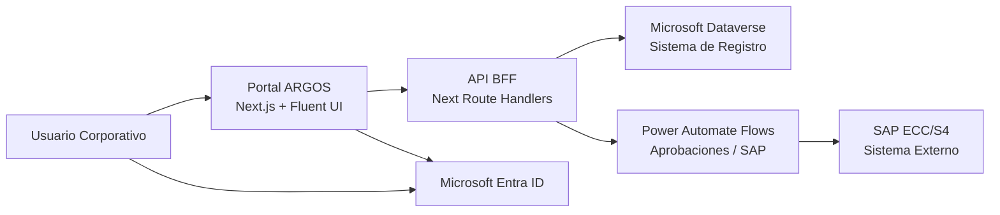
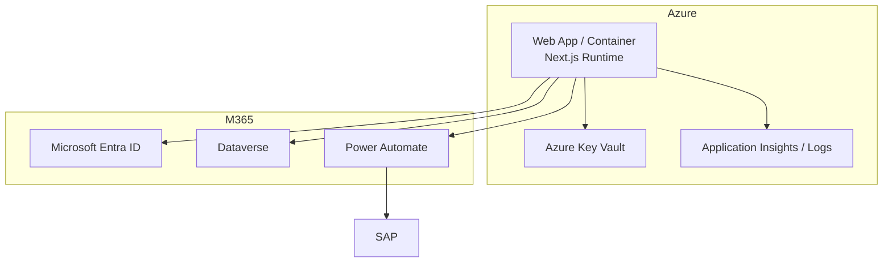
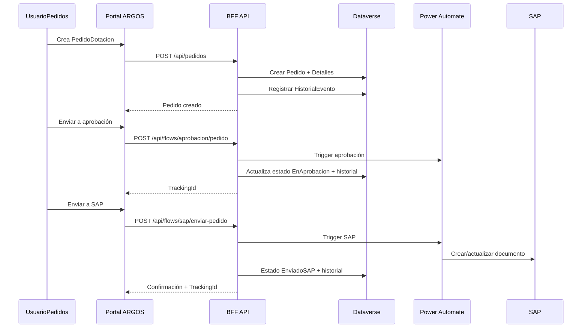
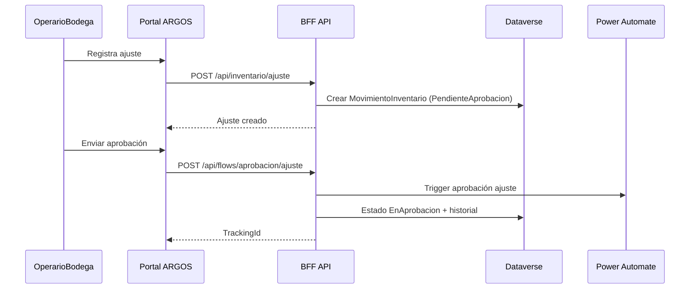

# ARGOS – Plataforma Integral
## Arquitectura de Solución para RFP (Enfoque EFP + Vista SA + Documentación de Procesos)

**Versión:** 1.0  
**Fecha:** 1 de marzo de 2026  
**Estado:** Propuesta técnica para RFP (MVP + Ruta a Producción)  
**Autoría:** Equipo de Arquitectura de Solución (SA) y Documentación de Procesos

---

## 1. Resumen Ejecutivo

ARGOS – Plataforma Integral es una solución empresarial para gestión operativa de **Dotación/Pedidos, Inventario, Calidad y Mantenimiento**, diseñada para reemplazar Power Pages en la capa de experiencia de usuario, conservando la inversión en Microsoft Power Platform:

- **Dataverse** como sistema de registro (SoR).
- **Power Automate Cloud Flows** como orquestador de aprobaciones e integración SAP.
- **Microsoft Entra ID** para identidad corporativa y SSO.
- **Next.js + TypeScript + Fluent UI** para experiencia moderna, accesible y móvil.

La arquitectura propuesta adopta un patrón **BFF (Backend for Frontend)** con controles de seguridad por rol y por sede, integración desacoplada con SAP, y modo de operación dual (**demo/dataverse**) para acelerar pilotos sin comprometer el diseño objetivo de producción.

---

## 2. Enfoque EFP para RFP

Este documento se estructura bajo un enfoque **EFP (Estrategia, Funcionalidad y Procesos)**:

- **Estrategia:** alineación con arquitectura empresarial Microsoft y reducción de riesgo en integración SAP.
- **Funcionalidad:** cobertura MVP de módulos críticos con trazabilidad a requisitos de negocio.
- **Procesos:** definición de flujos operativos, puntos de control, auditoría y gobernanza.

---

## 3. Alcance de Solución

### 3.1 Alcance funcional (MVP)

- Autenticación corporativa con Entra ID (SSO).
- Navegación y autorización por rol.
- Scoping por **Sede** en consultas y operaciones.
- CRUD operativo para:
  - `PedidoDotacion`
  - `MovimientoInventario`
  - `TicketMantenimiento`
- Flujos de negocio:
  - Enviar pedido a aprobación.
  - Enviar ajuste de inventario a aprobación.
  - Enviar pedido aprobado a SAP.
  - Sincronización de estado SAP (trigger manual/stub).
- Auditoría funcional en `HistorialEvento`.

### 3.2 Fuera de alcance MVP

- Lógica SAP embebida en frontend.
- Acceso directo SAP desde navegador.
- Multi-tenant productivo complejo.

---

## 4. Principios Arquitectónicos

1. **Security by Design**
   - Capa API intermedia obligatoria; no se exponen Dataverse/SAP al browser.
2. **Separation of Concerns**
   - UI, API/BFF, repositorios, integración y orquestación desacoplados.
3. **Least Privilege + RBAC + Row-Level Scope**
   - Autorización por rol y restricción por Sede en server side.
4. **Cloud-native Extensibility**
   - Integraciones mediante flujos, no hardcodeadas en UI.
5. **Operational Observability**
   - Trazabilidad por eventos y tracking IDs de integración.
6. **Pilot-to-Production**
   - Modo demo para aceleración, conservando interfaces de producción.

---

## 5. Vista SA: Arquitectura de Solución

### 5.1 Contexto (C4 Nivel 1)

### 5.2 Arquitectura por capas

| Capa | Tecnología | Responsabilidad |
|---|---|---|
| Presentación | Next.js App Router + Fluent UI | UX corporativa responsive, accesibilidad, navegación por módulo |
| Identidad | MSAL Browser + Entra ID | SSO, obtención de `id_token` |
| Seguridad de sesión | `jose` + cookie `httpOnly` | Validación token Entra, emisión de sesión firmada |
| API/BFF | Next.js Route Handlers | Autenticación, autorización, validación de payloads, contratos |
| Dominio/Repositorio | TS repositorios por dominio | CRUD, scoping por Sede, mapeos de entidades |
| Datos | Dataverse Web API | Persistencia transaccional y trazabilidad |
| Orquestación | Power Automate | Aprobaciones, integración SAP, sincronización de estados |

### 5.3 Componentes clave implementados

| Componente | Ruta técnica |
|---|---|
| Shell/Navegación | `src/components/layout/*` |
| API endpoints | `src/app/api/**/route.ts` |
| Auth guards API/Páginas | `src/lib/auth/api-auth.ts`, `src/lib/auth/page-guard.ts` |
| Sesión y validación JWT | `src/lib/auth/session.ts` |
| Cliente Dataverse | `src/lib/dataverse/client.ts` |
| Repositorios por dominio | `src/lib/dataverse/repositories/*` |
| Integración flows | `src/lib/flows/triggers.ts` |
| Configuración segura | `src/lib/config/env.ts` |

### 5.4 Patrón de repositorio y runtime

La capa de datos utiliza interfaces por dominio (`IPedidoRepository`, `IInventarioRepository`, etc.) y resolución de implementación por runtime:

- **`demo`**: store en memoria para pilotos.
- **`dataverse`**: persistencia real vía Web API.

Beneficio SA: extensibilidad (ej. `test`, `cache`, `hybrid`) sin modificar controladores ni UI.

### 5.5 Topología de despliegue de referencia

### 5.6 Seguridad y control de acceso

1. **Autenticación**
   - Frontend obtiene `id_token` con MSAL.
   - Backend valida firma/issuer/audience con JWKS de Entra.
2. **Sesión**
   - Emisión de cookie `httpOnly`, `SameSite=Lax`, firma HS256, expiración controlada.
3. **Autorización**
   - `requireApiUser()` y `requirePageUser()` por rol.
   - Scoping por Sede en repositorios (`scopeMatchesFilters`, `getRequestedSede`).
4. **Integración segura**
   - Trigger HTTP con `x-api-key` y/o bearer token.
   - Alternativa segura: cola `IntegrationRequest` en Dataverse.

### 5.7 Arquitectura de integración

Patrones soportados para flujos:

- **Patrón A (preferido):** BFF → HTTP Trigger Flow (sincronía de aceptación + tracking).
- **Patrón B (resiliente):** BFF → `IntegrationRequest` Dataverse → Flow asíncrono.

Resultado esperado:

- desacople entre experiencia web y lógica SAP,
- mayor mantenibilidad,
- mejor postura de seguridad.

---

## 6. Vista de Procesos (Equipo de Documentación)

### 6.1 Mapa de procesos (L1/L2)

| L1 | L2 | Resultado |
|---|---|---|
| Gestión de Dotación | Solicitud, aprobación, despacho, envío SAP | Pedido gestionado end-to-end |
| Gestión de Inventario | Movimientos, ajuste, aprobación | Stock confiable y auditable |
| Gestión de Calidad | Inspección, hallazgos, cierre | Cumplimiento de control de calidad |
| Gestión de Mantenimiento | Ticket, atención, cierre | Continuidad operativa de activos |

### 6.2 Flujo E2E: Pedido a Aprobación y SAP

### 6.3 Flujo: Ajuste de inventario

### 6.4 Artefactos de proceso recomendados para RFP

- SOP por módulo (alta, modificación, aprobación, cierre).
- Matriz RACI por rol (`SuperAdmin`, `AdminLocal`, etc.).
- Diccionario de datos funcional (campo, origen, uso, regla).
- Catálogo de eventos de auditoría (`HistorialEvento`).
- Matriz de excepciones y reprocesos (fallo de flow, timeout SAP, rollback funcional).

---

## 7. Arquitectura de Datos

### 7.1 Entidades nucleares

- Maestro organizacional: `Sede`, `Area`, `Bodega`, `Ubicacion`, `Empleado`.
- Dotación: `PedidoDotacion`, `PedidoDotacionDetalle`, `EntregaDotacion`.
- Inventario: `Inventario`, `MovimientoInventario`.
- Calidad: `InspeccionCalidad`, `DefectoCalidad`, `ChecklistCalidad`.
- Mantenimiento: `TicketMantenimiento`, `ActividadMantenimiento`, `PlanPreventivo`.
- Integración y auditoría: `IntegrationRequest`, `HistorialEvento`.

### 7.2 Reglas de modelado

- Todas las entidades operativas con `Sede` obligatoria para scoping.
- Estados controlados por catálogo tipado (evitar strings libres).
- Mapeo Dataverse centralizado en mappers (`rowTo*`).
- Historial de eventos como mecanismo transversal de trazabilidad.

### 7.3 Calidad de datos y gobierno

- Validación de payload con `zod` antes de persistencia.
- Reglas mínimas: campos requeridos, rangos numéricos, catálogos válidos.
- Recomendado para producción:
  - Data Quality Rules en Dataverse.
  - Identificadores funcionales únicos por módulo.
  - Políticas de retención de auditoría.

---

## 8. Requisitos No Funcionales (NFR)

| Categoría | Objetivo RFP | Control arquitectónico |
|---|---|---|
| Seguridad | Zero trust, sin exposición directa de core systems | BFF + sesiones `httpOnly` + RBAC + scoping por Sede |
| Disponibilidad | Operación continua en horario productivo | Hosting administrado + fallback por integración asíncrona |
| Rendimiento | Respuesta de UI de negocio < 2-3s (consultas estándar) | consultas optimizadas, `Promise.all`, paginación/top |
| Escalabilidad | Crecimiento de módulos y sedes | repositorios por dominio, interfaces y factories |
| Mantenibilidad | Cambios rápidos con bajo riesgo | separación por capas, tipado estricto, validación centralizada |
| Auditoría | Trazabilidad de acciones y estados | `HistorialEvento` + tracking IDs de flows |
| Accesibilidad | Cumplimiento corporativo WCAG | Fluent UI, foco visible, contraste y navegación teclado |

---

## 9. DevSecOps y Aseguramiento de Calidad

### 9.1 Controles recomendados de pipeline

1. Build y type-check.
2. Lint (reglas TS + React + accesibilidad).
3. Pruebas unitarias de dominio y repositorios.
4. Pruebas de contrato para endpoints API.
5. Escaneo de dependencias y secretos.
6. Gate de promoción por ambiente (`dev` → `qa` → `prod`).

### 9.2 Estrategia de ambientes

- **DEV:** integración temprana, datos sintéticos.
- **QA/UAT:** pruebas funcionales y de procesos por rol/sede.
- **PROD:** operación controlada, observabilidad y runbooks.

---

## 10. Riesgos, Supuestos y Mitigaciones

| Riesgo | Impacto | Mitigación |
|---|---|---|
| Cambios de esquema Dataverse (`crf1_*`) | Alto | capa de mapeo central + pruebas de contrato |
| Latencia o indisponibilidad de flows | Alto | patrón `IntegrationRequest` asíncrono + reintentos |
| Deriva de roles/claims en Entra | Medio/Alto | matriz de mapeo versionada + pruebas de autorización |
| Exposición accidental de secretos | Alto | Secret Manager/Key Vault + política de rotación |
| Deuda de UX en piloto estático | Medio | mantener piloto solo para demo visual; operación real en runtime Next |

Supuestos clave:

- Tenant Entra y Dataverse corporativos disponibles.
- Conectividad de Power Automate con SAP validada por equipo de integración.
- Gobierno de catálogos funcionales definido por negocio.

---

## 11. Roadmap recomendado (de MVP a Productivo)

1. **Fase 1 (MVP estable):** cierre de CRUD críticos + flows aprobación/SAP + hardening auth.
2. **Fase 2 (Industrialización):** observabilidad, pruebas automatizadas, colas/reintentos, RACI operativo.
3. **Fase 3 (Escala):** Power BI embebido por rol/sede, SLA/SLO formal, optimización avanzada de rendimiento.

---

## 12. Matriz de Trazabilidad RFP (Resumen)

| Requerimiento RFP | Cobertura propuesta | Estado |
|---|---|---|
| SSO corporativo | Entra ID + validación backend + sesión segura | Implementado MVP |
| RBAC por rol y sede | guards API/página + scoping en repositorios | Implementado MVP |
| Dataverse como SoR | cliente OAuth + repositorios por dominio | Implementado MVP |
| Aprobaciones y SAP por flows | triggers HTTP/Dataverse + tracking | Implementado MVP |
| UX enterprise responsive | Fluent UI + layout corporativo + accesibilidad base | Implementado MVP |
| Auditoría de negocio | `HistorialEvento` en transacciones clave | Implementado MVP |
| Documentación de arquitectura/procesos | este documento + SOP/RACI recomendados | Entregable RFP |

---

## 13. Conclusión Ejecutiva

La arquitectura de ARGOS está alineada con estándares empresariales para plataformas Microsoft: separa experiencia digital, datos y orquestación; protege sistemas críticos mediante BFF y controles de identidad; y permite evolución incremental hacia producción sin re-trabajar la base técnica del MVP.

La propuesta responde al RFP con una base sólida, escalable y auditable, integrando visión de **arquitectura de solución (SA)** y **documentación de procesos operativos** para asegurar viabilidad técnica y adopción organizacional.

